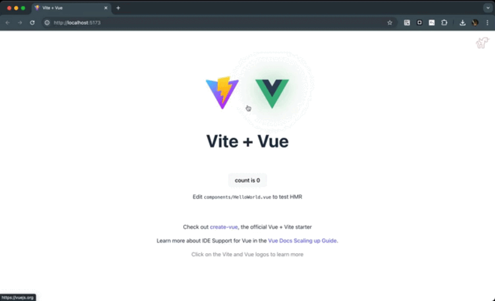

<p align="center">
  <a href="https://github.com/hellof2e/vite-plugin-dev-inspector">
    
  </a>
</p>

<p align="center">
  <a href="https://www.npmjs.com/package/vite-plugin-dev-inspector" target="_blank" rel="noopener noreferrer"></a>
  <a href="https://github.com/hellof2e/vite-plugin-dev-inspector/blob/main/LICENSE" target="_blank" rel="noopener noreferrer"></a>
</p>


<h1 align="center">
  Vite-plugin-dev-inspector
</h1>

<p align="center">
<a href="https://stackblitz.com/edit/vitejs-vite-shxjct?file=src%2FApp.vue"></a>
</p>


<p align="center">
  <span>简体中文 | </span>
  <a href="./README.en-US.md">
  English
  </a>
</p>


## 介绍

一个Vite插件，点击页面元素，IDE直接打开对应代码文件。支持 Vue2, Vue3, React, Svelte,Angular, SSR等任何前端工程。

<p align="center">

</p>

## 安装

```bash

# vite-plugin-dev-inspector

npm install vite-plugin-dev-inspector -D
```

## 使用


### 快捷键

* Mac: Command(⌘) + Shift(⇧)
* Windows: Ctrl + Shift(⇧)


### Vite 配置

```ts
// for Vue2

import { defineConfig, } from 'vite'
import { createVuePlugin, } from 'vite-plugin-vue2'
import inspector from 'vite-plugin-dev-inspector'

export default defineConfig({
  plugins: [
    createVuePlugin(),
    inspector({
      toggleButtonVisibility?: 'always', // always默认展示切换icon；never不展示icon（使用快捷键唤醒）
    }),
  ],
})
```

```ts
// for Vue3

import { defineConfig } from 'vite'
import Vue from '@vitejs/plugin-vue'
import inspector from 'vite-plugin-dev-inspector'

export default defineConfig({
  plugins: [
    Vue(),
    inspector()
  ],
})
```

```ts
// for react
import { defineConfig } from 'vite'
import react from '@vitejs/plugin-react'
import inspector from 'vite-plugin-dev-inspector'

// https://vitejs.dev/config/
export default defineConfig({
  plugins: [
    react(),
    inspector(),
  ],
})
```

```ts
// for preact
import { defineConfig } from 'vite'
import preact from '@preact/preset-vite'
import inspector from 'vite-plugin-dev-inspector'

// https://vitejs.dev/config/
export default defineConfig({
  plugins: [
    preact(),
    inspector(),
  ],
})
```


```ts
// for svelte
import { defineConfig } from 'vite'
import { svelte } from '@sveltejs/vite-plugin-svelte'
import inspector from 'vite-plugin-dev-inspector'

// https://vitejs.dev/config/
export default defineConfig({
  plugins: [
    svelte(),
    inspector(),
  ],
})
```

### Options


```ts
inspector({
  /**
   * Toggle button visibility / 切换按钮隐藏展示
   * @default 'active'
   */
  toggleButtonVisibility?: 'always' | 'active' | 'never'

  /**
   * Default enable state
   * @default false
   */
  enabled?: boolean

  /**
   * Define a combo key to toggle inspector
   * @default 'control-shift' on windows, 'meta-shift' on other os
   *
   * any number of modifiers `control` `shift` `alt` `meta` followed by zero or one regular key, separated by -
   * examples: control-shift, control-o, control-alt-s  meta-x control-meta
   * Some keys have native behavior (e.g. alt-s opens history menu on firefox).
   * To avoid conflicts or accidentally typing into inputs, modifier only combinations are recommended.
   * You can also disable it by setting `false`.
   */
  toggleComboKey?: string | false


  /**
   * append an import to the module id ending with `appendTo` instead of adding a script into body
   * useful for frameworks that do not support trannsformIndexHtml hook (e.g. Nuxt3)
   *
   * WARNING: only set this if you know exactly what it does.
   */
  appendTo?: string | RegExp

  /**
   * Customize openInEditor host (e.g. http://localhost:3000)
   * @default false
   * @deprecated This option is deprecated and removed in 5.0. The plugin now automatically detects the correct host.
   */
  openInEditorHost?: string | false

  /**
   * lazy load inspector times (ms)
   * @default false
   */
  lazyLoad?: number | false

  /**
   * disable inspector on editor open
   * @default false
   */
  disableInspectorOnEditorOpen?: boolean

  /**
   * Hide information in VNode and produce clean html in DevTools
   *
   * Currently, it only works for Vue 3
   *
   * @default true
   */
  cleanHtml?: boolean

  /**
   * Target editor when open in editor
   *
   * @default code (Visual Studio Code)
   */
  launchEditor?: 'appcode' | 'atom' | 'atom-beta' | 'brackets' | 'clion' | 'code' | 'code-insiders' | 'codium' | 'emacs' | 'idea' | 'notepad++' | 'pycharm' | 'phpstorm' | 'rubymine' | 'sublime' | 'vim' | 'visualstudio' | 'webstorm'
})
```


## Notes
Vite-plugin-dev-inspector was inspired by [vite-plugin-vue-inspector](https://github.com/webfansplz/vite-plugin-vue-inspector), but it does not repy on front-end frameworks. It can support any front-end technology stack at the same time, such as Vue 2 & 3, React, Angular, Svelte, Nuxt and SSR.

## License

[MIT LICENSE](./LICENSE)
